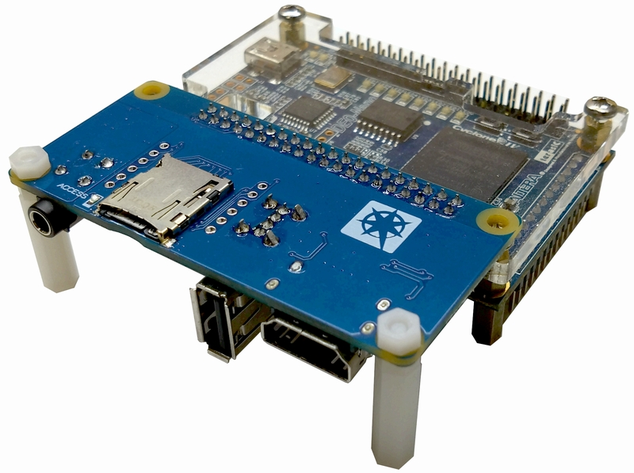
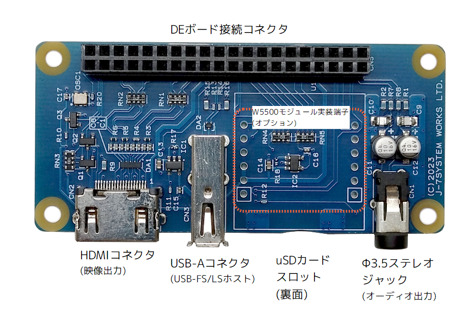
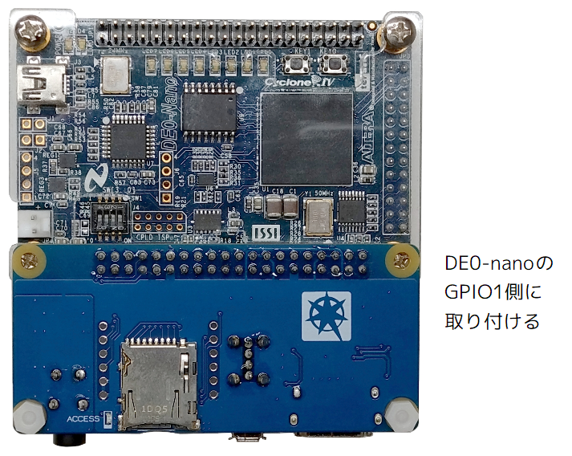
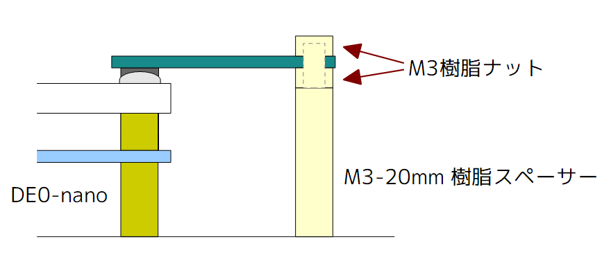

# DE0-nano/DE10-Lite用 I/O拡張ボード

本ボードは、Terasic DE0-nanoおよびDE0-Liteボードに映像出力、USB、microSDおよびアナログ音声を追加するI/O拡張ボードです。  
Terasic 40ピンGPIOコネクタで FPGA ボードと接続し、HDMI出力、USB 2.0 フルスピード/ロースピード・ホスト機能、microSD カードスロット、ステレオ・ライン出力を提供します。

## 内容物

|内容物|数量|
|---|---|
|KYANITE2_PCB|1|
|M3-20mm 樹脂スペーサー|2|
|M3樹脂ナット|4||

## 使用許諾、ライセンスおよび免責
**本ボードについて下記事項を了承の上で使用してください。**
- 直射日光に晒される場所、高温や低温になる場所、結露・氷結の発生する場所、過度の衝撃や振動の発生する場所で使用しないでください。
- 本ボードは試作およびホビー用として設計されています。一般製品を意図した逆接続、逆挿入、過電圧等の保護はされていません。誤った使用は破損、発煙、発火の原因となります。
- 本ボードを使用して発生した直接的、間接的損害について開発元および販売元は一切の責務を負いません。
- 本ボードの内容および使用、測定データ、技術情報、サポート等に関してのお問い合わせは原則としてお答え致しかねます。
- 部品調達や性能改善に伴い、予告なく仕様または部品の変更を行う場合があります。
- このリポジトリのソフトウェアおよび付属ドキュメントは [MIT License](LICENSE) で提供されます。ハードウェアの製作・改造・使用は利用者自身の責任で行ってください。本ボードおよび設計データは現状有姿で提供され、商品性、特定目的への適合性、権利非侵害を含む保証はありません。

## 対応ボードと開発環境

|項目|内容|
|---|---|
|接続先|Terasic DE0-nano（Cyclone IV E）、DE10-Lite（MAX 10）|
|接続コネクタ|GPIO 2 x 20 ピン|
|設計環境|Quartus Prime 20.1 以降|

サンプル・プロジェクトは `project/de0nano/` にあります。DE10-Lite で使用する場合は、ターゲット・デバイス、ピン割当、タイミング制約を対象ボードに合わせて確認・調整してください。

## 主な機能

|機能|コネクタ/実装|概要|
|---|---|---|
|映像出力|HDMI Type-A (`CN2`)|TMDS データ 3 ペア + クロック 1 ペア。DDC（EDID）および HPD 信号を接続。|
|USB ホスト|USB Type-A (`CN3`)|USB 2.0 LS/FS ホスト。VUSBはFPGAボードの5Vを電源スイッチで制御。|
|ストレージ|microSD スロット (`CN4`、基板裏面)|1bit-SPIモードおよび4bit-SDモード対応。カード検出および電源制御を接続。|
|音声出力|φ3.5 mm ステレオジャック (`CN1`)|アナログ・ライン出力。PWMおよび1bit⊿Σ出力時のスイング幅は約 1.5 Vp-p。|
|アクセス表示| LED (`LED1`)|`ACCESS` 信号で駆動。|
|Ethernet（任意）|WIZ850io 実装用フットプリント (`U1`)|WIZ850io をオプション実装可能。SPI と割り込み/リセットを使用。|
|外部クロック|`OSC1`|`EXTCLK` 48.000 MHz を供給。|

## DE0-nanoへの取り付け

KYANITE2 PCB は **DE0-nano の GPIO1 側**に取り付けます。40 ピン・ヘッダの向きと、基板の取付穴位置を確認して、無理な力を加えずに装着してください。

高さを合わせるために、同梱のM3-20樹脂スペーサーとナットを以下の取付図のように組み付けてください。

## 回路図
[kyanite2_pcb_revA_schem.pdf](pcb/kyanite2_pcb_revA_schem.pdf) 

## 電源と電気的な注意

- TMDS 信号の安定性のため、次の端子を GND 出力に設定してください。
`D2`、`D4`、`D10`、`D12`
- USB VBUS と microSD の電源は、それぞれ `AP22816BKB` 電源スイッチで制御されます。電源をONにするには FPGA 側で `/VUSB_EN`、`/PWR_EN` を`L`レベルに駆動してください。
- HDMI の DDC は双方向信号です。レベル変換回路を介して FPGA の 3.3V I/O 信号に接続されています。
- アナログ音声出力は、FPGA からの `AUD_L`/`AUD_R` を RC フィルタと DC カット用コンデンサを通して出力します。1.5 Vp-pのラインレベル出力で、ヘッドホンやスピーカーの駆動はできません。
- USB は LS/FS 用です。USB High-Speed 動作は対象外です。
- WIZ850io は未実装でも、HDMI、USB、microSD、音声出力の基本機能には影響しません。

## サンプル・プロジェクト

|ディレクトリ|内容|
|---|---|
|`de0nano_blank/`|KYANITE2 の I/O を定義した最小構成のテンプレート|
|`de0nano_hdmi/`|HDMI 映像出力テスト|
|`de0nano_wavplayer/`|microSD 上の WAV ファイル再生、映像表示および音声出力のサンプル|

またIPコアはこちらも参考してください。
- ローエンドFPGA向け HDMI-TX IPコア [github.com/osafune/hdmi_tx](https://github.com/osafune/hdmi_tx)
- PERIDOTペリフェラル [github.com/osafune/peridot_peripherals](https://github.com/osafune/peridot_peripherals)

---

c 2026 PERIDOT CRAFT / J-7SYSTEM WORKS LIMITED.
